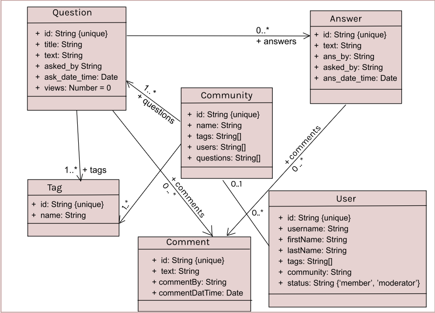

Group 206
Elizabeth Jones, Pooja Gidwani, Kristen Liu, Isha Srivastava

The individual and team project for this class are designed to mirror the experiences of a software 
engineer joining a new development team: you will be “onboarded” to our codebase, make several 
individual contributions, and then form a team to propose, develop and implement new features. 
The codebase that we’ll be developing on is a Fake Stack Overflow project (let’s call it HuskyFlow). 
You will get an opportunity to work with the starter code which provides basic skeleton for the app 
and then additional features will be proposed and implemented by you! All implementation will take 
place in the TypeScript programming language, using React for the user interface.

Refer to the [Project Overview]
(https://neu-se.github.io/CS4530-Fall-2024/assignments/project-overview) 
for more instructions on the project deliverables and expectations.

{ : .note } Refer to [IP1](https://neu-se.github.io/CS4530-Fall-2024/assignments/ip1) and 
[IP2](https://neu-se.github.io/CS4530-Fall-2024/assignments/ip2) for instructions related to setting 
up MongoDB, setting environment variables, and running the client and server.

{ : .note } The fields of the Schemas were changed. As a result, features such as view counts will 
not work on database entries that were made in IP1 and IP2. If you want to test features, delete old 
database entries and make new questions either through manually making it in the client or 
run populate_db.ts.

## Database Architecture

The schemas for the database are documented in the directory `server/models/schema`.
A class diagram for the schema definition is shown below:

### Final Project
Our program, CodeQuest, is a software question site. The baseline functionality including asking 
and answering questions, in addition to support for adding comments. We expanded on this, first with 
a login process for the application. Here, user data is stored and authenticated with Firebase. 
Moreover, when thinking about users on software question site, they will often have specific 
languages or systems they want to learn about. Thus, we support a feature for a user to choose tags 
that interest them (which they can also update later). We take this information and then suggest a 
community for the user to join, which they can accept, choose their own, or omit. Using this 
information, we have a homepage which displays different questions that might be relevant to the 
user, based on their community if specified. In addition, users will have a status based on a 
threshold of reliability that will define them as either a member or moderator. Moderators can edit 
or delete posts in their community. We implemented a chat feature so we can talk to other users in 
real time, as well as a chat feature built into the communities.

To run a working version of CodeQuest, first ensure you have all the required dependencies. You can view the downloadable code workspace in Visual Studio, which can be downloaded online. You can also download MongoDB for data storage purposes in the program. Once it is open, run curl -o- https://raw.githubusercontent.com/nvm-sh/nvm/v0.40.1/install.sh in the root directory. Also run nvm install 20. In the server directory, run npm install. Populate the database by running npx ts-node populate_db.ts mongodb://127.0.0.1:27017/fake_so here. In the client directory, run npm install. Also run npm install firebase. If not present, add a .env file in the client directory with this line REACT_APP_SERVER_URL=http://localhost:8000. In the server directory, add a .env file with these lines MONGODB_URI=mongodb://127.0.0.1:27017, CLIENT_URL=http://localhost:3000, PORT=8000. 

After you have this sorted out, you can run the program by running npx ts-node server.ts in the server directory, and npm run start in the client directory. 

